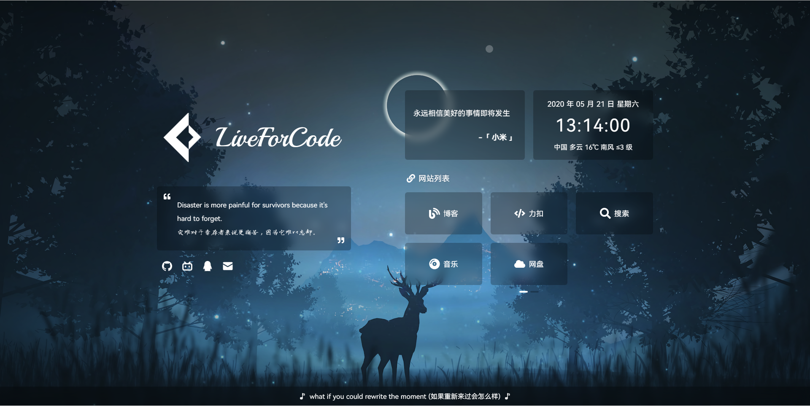

# 🏠 Home

基于 [IMSYY/Home](https://github.com/imsyy/Home) 修改而来的个人主页，使用 Vue 3 + Vite 构建。



## 📎 在线演示

> 查看最新效果可能需要 `Ctrl + F5` 强制刷新浏览器缓存

- [imyxj.xyz](https://imyxj.xyz)

## ✨ 功能特性

| 功能 | 说明 |
|------|------|
| 载入动画 | 页面加载过渡动画 |
| 站点简介 | 点击切换简介内容 |
| Hitokoto 一言 | 随机展示一句话 |
| 日期及时间 | 实时显示当前日期时间 |
| 实时天气 | 基于高德 API 的天气信息 |
| 时光进度条 | 可视化展示当日/当年进度 |
| 音乐播放器 | 基于 APlayer + Meting |
| DailySentence | 金山词霸每日一句 |
| 触摸滑动 | Swiper 触摸滑动切换 |
| 默哀模式 | 支持手动/自动开启 |
| 响应式适配 | 适配 PC / 平板 / 手机 |
| PWA | 支持离线访问 |

## 🛠 技术栈

| 类别 | 技术 |
|------|------|
| 框架 | [Vue 3](https://cn.vuejs.org/) |
| 构建 | [Vite](https://vitejs.dev/) |
| 状态管理 | [Pinia](https://pinia.vuejs.org/) |
| UI 组件 | [Element Plus](https://element-plus.org/) |
| 图标 | [xicons](https://xicons.org/) / [IconPark](https://iconpark.oceanengine.com/) |
| 触摸滑动 | [Swiper](https://www.swiper.com.cn/) |
| 音乐播放 | [APlayer](https://aplayer.js.org/) |
| 样式 | SCSS |
| PWA | [vite-plugin-pwa](https://vite-pwa-org.netlify.app/) |

## 🚀 快速开始

### 环境要求

- Node.js >= 16.16.0
- npm >= 8.15.0（推荐使用 [pnpm](https://pnpm.io/)）

### 安装与运行

```bash
# 克隆项目
git clone https://github.com/first19326/Home.git
cd Home

# 安装 pnpm（如已安装可跳过）
npm install -g pnpm

# 安装依赖
pnpm install

# 启动开发服务器
pnpm dev

# 构建生产版本
pnpm build
```

构建产物在 `dist` 目录，可部署至任意静态服务器或托管平台（Vercel、Netlify 等）。

## ⚙️ 配置

所有配置通过 `.env` 环境变量和 `public/data/` 目录下的 JSON 文件完成。

### 环境变量（`.env`）

```env
# 站点信息
VITE_SITE_NAME = "Jay"
VITE_SITE_AUTHOR = "Jay"
VITE_SITE_KEYWORDS = "Jay, HomePage"
VITE_SITE_DES = "Jay's Personal HomePage !"
VITE_SITE_URL = "https://imyxj.xyz"

# 简介文本（点击可切换）
VITE_DESC_HELLO = "Hello World !"
VITE_DESC_TEXT = "一个建立于 21 世纪的小站，存活于互联网的边缘。"
VITE_DESC_HELLO_OTHER = "Oops !"
VITE_DESC_TEXT_OTHER = "哎呀，这都被你发现了（ 再次点击可关闭 ）！"

# 一言默认数据（接口失效时显示）
VITE_HITOKOTO_TEXT = "简单地活着，肆意而又精彩。"
VITE_HITOKOTO_FROM = "Jay"

# 建站日期（YYYY-MM-DD 格式，用于时光进度条）
VITE_SITE_START = "2026-10-01"

# 天气 Key（需前往高德开放平台申请）
VITE_WEATHER_KEY = "your_key_here"

# 各类 JSON 数据文件路径（无需修改）
VITE_MUSIC_URL = "/data/music.json"
VITE_SOCIAL_URL = "/data/socialLinks.json"
VITE_LISTS_URL = "/data/websiteLists.json"
VITE_BACKGROUND_URL = "/data/background.json"
VITE_MOURN_URL = "/data/mourn.json"
VITE_RECORDS_URL = "/data/updateRecords.json"
VITE_CONSOLE_URL = "/data/console.json"
```

### 天气配置

前往 [高德开放平台控制台](https://console.amap.com/dev/index) 创建 `Web 服务` 类型的 Key，填入 `.env` 中的 `VITE_WEATHER_KEY`。

> 如需更高定位精度，可将 `Web API` 更换为 `JS API`（需修改代码）。

### 音乐配置

编辑 `public/data/music.json`：

```json
{
    "server": "netease",
    "type": "playlist",
    "id": "2243342814"
}
```

| 参数 | 说明 |
|------|------|
| `server` | `netease`（网易云）、`tencent`（QQ 音乐） |
| `type` | `song`、`playlist`、`album`、`search`、`artist` |
| `id` | 歌曲 ID 或歌单 ID |

> ⚠️ 仅支持中国大陆地区。若使用 QQ 音乐歌单，歌曲数量建议不超过 50 首。
> 
> 如需自定义 Meting API 服务，请参照 [Meting-API](https://github.com/xizeyoupan/Meting-API) 自行部署。

### 社交链接

编辑 `public/data/socialLinks.json`：

```json
[
    {
        "name": "Github",
        "icon": "/image/icon/github.png",
        "tip": "去 Github 看看 !",
        "url": "https://github.com/first19326"
    }
]
```

> 最多配置 **7** 个社交链接，超出需自行适配样式。

### 网站列表

编辑 `public/data/websiteLists.json`。支持多个列表分组（网站列表、功能列表、友情链接等），每个分组内每页最多 **6** 个项目，超出的不展示，通过 Swiper 实现分页滑动。

图标支持通过 `src/components/Lists/index.vue` 中的 `icons` 映射表进行扩展，功能方法通过 `methods` 映射表进行关联。

### 背景图片

编辑 `public/data/background.json`：

```json
[
    {
        "name": "默认背景",
        "url": "",
        "images": ["/image/background/home.jpg", "/image/background/back.jpg"]
    },
    {
        "name": "每日一图",
        "url": "https://api.dujin.org/bing/1920.php",
        "images": []
    }
]
```

- `url` 为空时，随机从 `images` 数组中选取本地图片
- `url` 不为空时，使用该 URL 作为背景
- ⚠️ 默认背景必须放在数组首位，且 `url` 置空
- ⚠️ 部分浏览器不支持 WebP 格式，请避免使用

### 默哀模式

编辑 `public/data/mourn.json`：

```json
{
    "mournSwitch": false,
    "mournText": ""
}
```

> 此配置用于手动开启默哀模式（非指定日期），程序内置了特定日期的自动默哀逻辑。

### 更新日志

编辑 `public/data/updateRecords.json`，包含 `fix`、`new`、`delete`、`update` 四个分类的日志条目。

### 控制台输出

编辑 `public/data/console.json`，支持三种模式：

- **默认**：固定颜色输出，直接填写字符串数组
- **random**：随机颜色输出
- **banner**：Badge 风格输出，每项为 `["标题", "内容"]` 格式

## 📡 数据 API

| 功能 | 来源 |
|------|------|
| 天气 | [高德开放平台](https://lbs.amap.com/) |
| 一言 | [Hitokoto](https://hitokoto.cn/) |
| 每日一句 | [金山词霸](http://m.iciba.com/daily/) |
| 音乐 | [Meting API](https://api.i-meto.com/meting/api/) |
| 背景图 | 本地 / [必应每日一图](https://api.dujin.org/bing/1920.php) |

## ❓ 常见问题

### 加载速度慢？

本地开发时因 Vite 使用 HTTP/1.1 导致首次加载较慢，属正常现象。部署后使用 CDN 加速可显著改善，参考 [静态网站部署指南](https://notes.worstone.cn/article/479644713/)。

### 音乐无法自动播放？

浏览器限制自动播放。以 Edge 为例：**设置 → Cookie 和网站权限 → 媒体自动播放**，添加你的网站地址即可。

## 📝 更新日志

- **2024-01-04** — 添加样式，适配各种屏幕尺寸
- **2024-01-02** — 修复音乐播放器加载失败时键盘控制仍生效的问题；修复音量设置问题；优化 APlayer 加载逻辑
- **2024-01-01** — 将 `vue3-aplayer` 替换为 `@worstone/vue-aplayer` 并完成适配
- **2023-11-14** — 优化音乐播放器歌词样式

## 📄 许可证

基于 [IMSYY/Home](https://github.com/imsyy/Home) 修改，遵循原项目许可证。